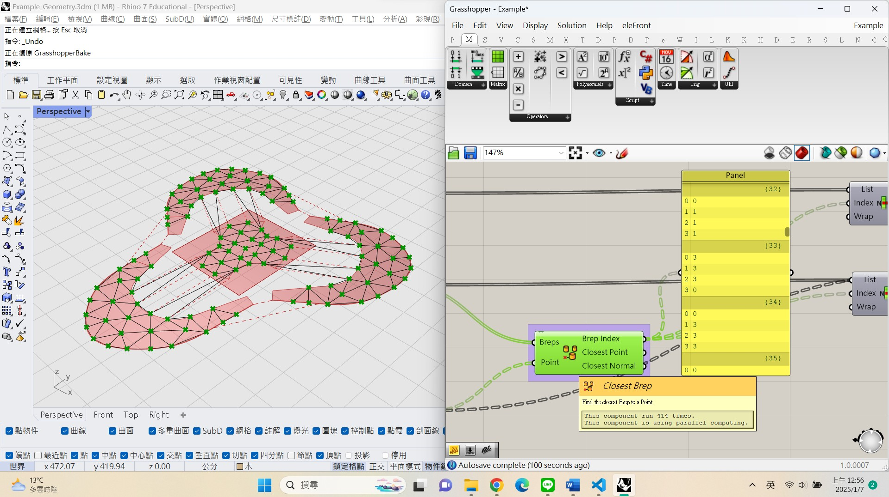
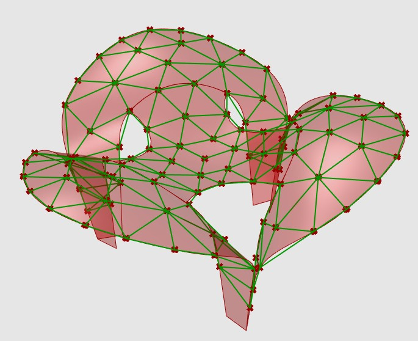

## UV map

Mapping multiple planar shapes onto a surface in one time go involves four main steps.
1. Prepare the planes and the surface to be used and arrange them in a corresponding list. 
2. Draw the planar shapes that need to be mapped.
3. Determine which plane each node of the shapes belongs to.
4. Map the points to their corresponding positions on the surface.

Since the first two steps are preparatory and relatively simple, I will focus on explaining the last two steps.

#### Which surface

First, convert the planar shapes into points, and then use the "Closest Brep" component to find the nearest Brep. When there is no overlap between planes, the closest Brep will inevitably be the one that encloses the point. From this, we can determine which plane or surface the point belongs to and subsequently map it to the corresponding numbered 3D surface.

#### Map

The detailed process of UV mapping is as follows. First, use the "Surface Closest Point" component to obtain the UV coordinates of a point on the planar shape. Next, apply the "Evaluate Surface" component, which analyzes the parameters of the UV point on the surface. This component is particularly useful for mapping the UV points from the plane to the corresponding positions on the surface.

Once these steps are completed, connect the points using the "Polyline" component to form the desired shape on the surface. The final result is as follows.

<<<<<<< HEAD:1.UV_map/README.md

=======

>>>>>>> 832ee87f3b8a1bc97a25c948d2a0db227e31946b:1.UV_map/0.README.md
