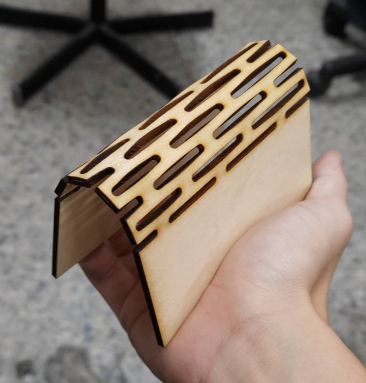
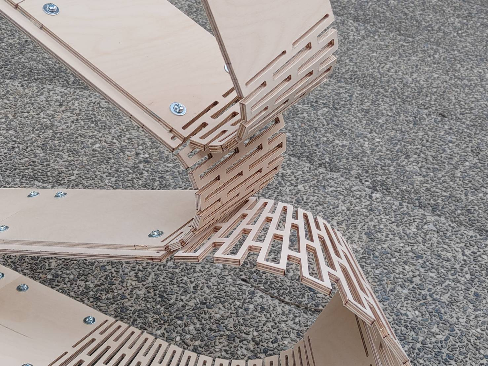

##Introduction

Based on research into the relationship between cutting patterns and bending angles, parametric methods can be used to reverse-engineer the density of cutting patterns required for specific bending angles. This enables the design of highly customizable components for constructing complex shapes on a large scale.

While designing small-scale structures, it is crucial to consider not only the relationship between wood bending and cutting patterns but also the machining limits of the equipment and the material utilization rate. Through continuous trial and error, adjustments are made iteratively to optimize the process.

This project involves diverse tasks spanning experimentation, derivation, digital design, manufacturing, and geometric optimization. The research is planned to last approximately one year. The primary goal for this semester is to complete a full cycle of the design-to-manufacturing workflow, testing the physical and geometric limits of various material parameters and establishing the necessary tools for each step. In the following semester, the manufacturing experiences will be fed back into the initial design to refine both the overall form and localized details.

sample

stage result
